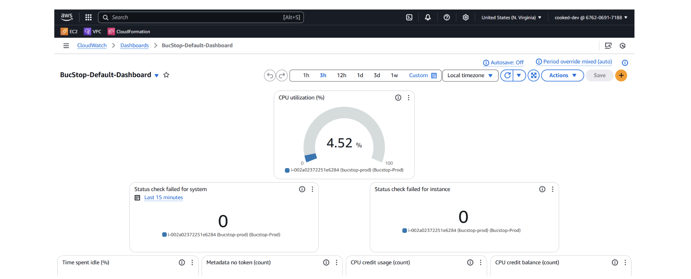
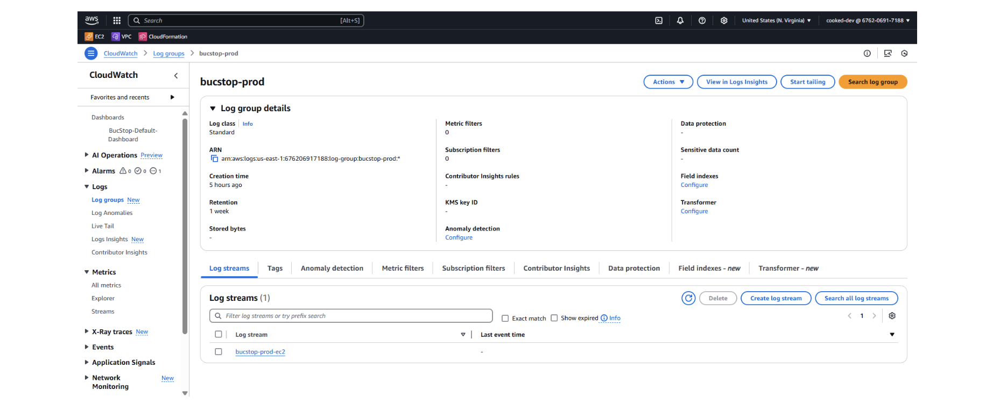
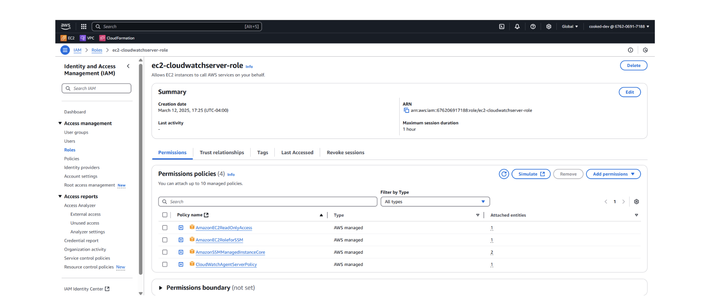
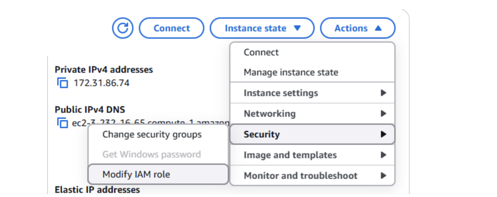
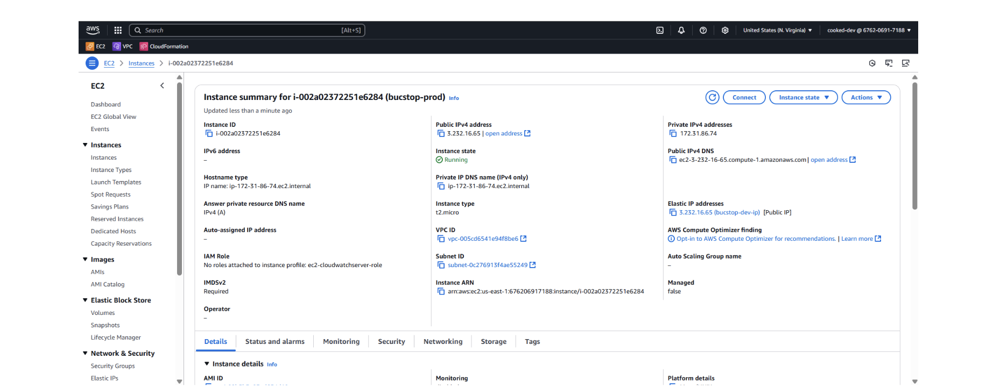
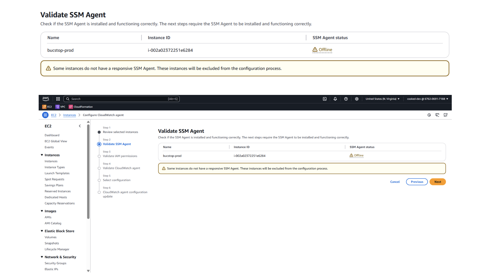

# CloudWatch Logging Information

**Author:** Curtis Reece  
**Sprint:** 4  
**Associated PBI/Task:** Setup CloudWatch EC2 Health Logging

I spent around 4 hours working on this and Chris Powers spent a few hours looking into it and trying to help me as well. We believe that we are running into permission issues as the few different solutions that we have tried have run into a problem with IAM roles not actually being assigned to the instance and the instance having an unresponsive SSM agent (which could be associated with the IAM roles issue).

The instance is still monitoring various metrics which can be viewed in both EC2 and CloudWatch, and I have set up a custom dashboard in CloudWatch with every basic metric that is monitored. However, none of the metrics are being logged to a log file in CloudWatch as we have been unable to set up a CloudWatch Agent in the EC2 instance for the above mentioned reasons.

In addition, there is a CloudWatch Log Group and Log Stream set up in CloudWatch. The Log Stream will be where logs are accessible whenever the task is finished.

Part of configuring a CloudWatch agent is setting up an IAM role to give the EC2 instance certain permissions.

You can modify the IAM role attached to the EC2 instance through a security action on the EC2 Details page:

However, whenever we go to actually attach the role to the instance we run into the following issue:

When attempting one of the approaches where we would configure the CloudWatch agent from the EC2 instance page under the monitoring section when the instance is running, we encounter the following error:

## Useful Resources

Some useful videos with different approaches that we have tried:
* https://www.youtube.com/watch?v=hqGnDzCIMBg
* https://www.youtube.com/watch?v=7UlFuwONrvQ

---

## Required Images:
* `images/CloudwatchLoggingInfo/image_1.png`
* `images/CloudwatchLoggingInfo/image_2.png` 
* `images/CloudwatchLoggingInfo/image_3.png`
* `images/CloudwatchLoggingInfo/image_4.png`
* `images/CloudwatchLoggingInfo/image_5.png`
* `images/CloudwatchLoggingInfo/image_6.png`