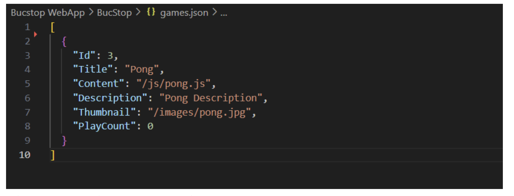
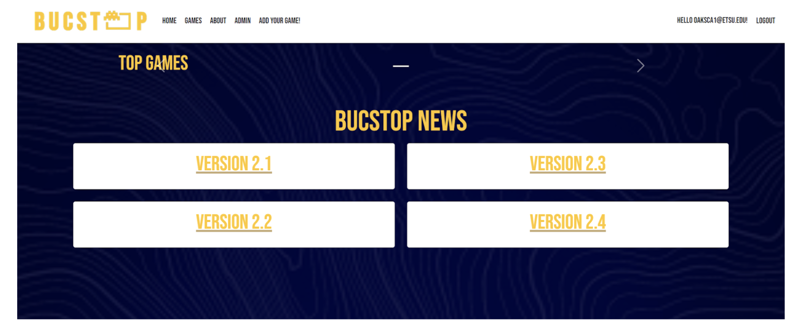
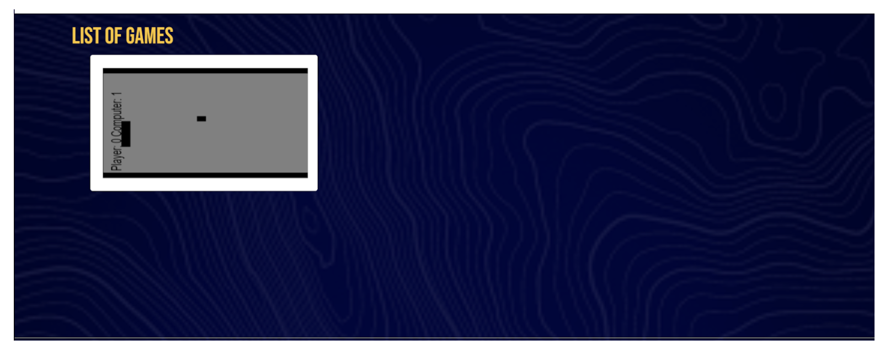
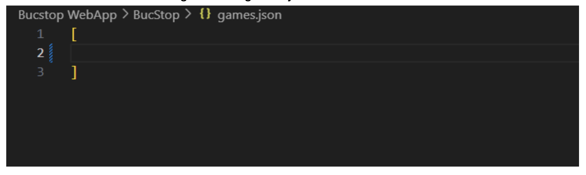

# Emptying games.json

After getting rid of snake and tetris from `games.json` and clearing the cache, the landing page changed to look like the following:

The arrows that are normally used switch between games essentially no longer function. I have tried multiple times to switch to "Pong" this way, as it should be the same, but it still stays in the state shown in above image.

Moving on to the Games list itself, Pong is now the only featured game. While hovering over the game, a teal drop down menu appears that shows play count and the description. Interestingly, the same drop down menu appears if you hover over where the other games should be on the right side.

I then decided to remove Pong from the `games.json` list.

I initially forgot to clear the cache after making the above change. After doing so, "Pong" has now been removed.

---

## Required Images:
* `images/EmptyingGamesJSON/image_1.png`
* `images/EmptyingGamesJSON/image_2.png`
* `images/EmptyingGamesJSON/image_3.png`
* `images/EmptyingGamesJSON/image_4.png`
* `images/EmptyingGamesJSON/image_5.png`