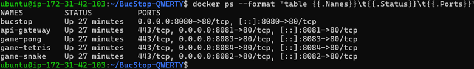
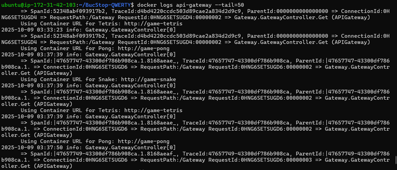
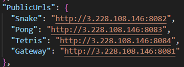
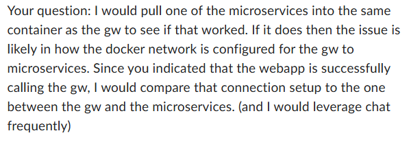

Potential Problems with API GW

During the course of the Sprints, the team encountered an issue where the game services were not loading in production. Testing on my own staging instance. It appears the gateway is running perfectly fine while the instance is running.

When checking the gateway logs, it shows that the Gateway is running and is communicating with the games services over the internal network, not being skipped over.  

It appears that the Public URLS are hardcoded for the games, so when the gateway builds its catalog it uses returns old links. The browser then tries to load the dead URLs, which causes the time out (even though the gateway is talking to the games internally).   

Potential fix: 
Make the Gateway build URLs dynamically. 
In this way:
•	The Gateway no longer reads hardcoded IPs from the JSON files.
•	Instead, it uses the host from the incoming HTTP request (e.g., Request.Host) to determine what IP or domain to use when sending URLs to clients.
•	The internal connections between microservices (example: game-snake, game-tetris) stay inside Docker’s network using their service names.
•	Only the Gateway is exposed to the internet.

With this design:
•	When your instance restarts with a new IP, the Gateway automatically reflects it.
•	You don’t need to touch your config files ever again.

Implement a Gateway Proxy model.
This approach goes a step further by making the Gateway act as the single public access point for all the game services. Instead of exposing each game’s port (like 8082–8084) to the internet, the Gateway would forward or “proxy” requests internally to the right container.

In this way:
•	The Gateway becomes the only service visible to the outside world.
The games (Snake, Pong, Tetris) remain private and only communicate through the internal Docker network.
•	Each game can be reached through clean routes such as /games/snake, /games/pong, or /games/tetris rather than separate ports.
•	The Gateway would fetch and return the proper JavaScript files or assets from those internal containers.

With this design:
•	The public IP or port changes no longer matter, the browser always talks to the Gateway, and the Gateway handles routing behind the scenes.
•	It becomes much easier to add new games or replace existing ones because you only update internal service mappings, not public URLs.
• This structure improves security since only one endpoint (the Gateway) is exposed to external traffic, reducing potential attack surfaces.
•	The system is more scalable and production-ready, since microservices can move freely between instances without breaking external access.
In short, while making the Gateway dynamically build URLs fixes the IP issue, implementing a proxy layer future-proofs the whole system by removing the need for direct public communication with individual game containers.

Response from Kinser, could be helpful

