# Tetris Documentation: Spring 25 – Izzy

## 1. Frontend: Game Logic

The JavaScript game uses the jQuery library. The logic handles the gameplay mechanics and interaction with the grid. Key methods include:

### 1. `getRandomInt()`:
* Method takes in 2 parameters; it then sets a floor and ceiling. Once done it finds a random within the values given values.

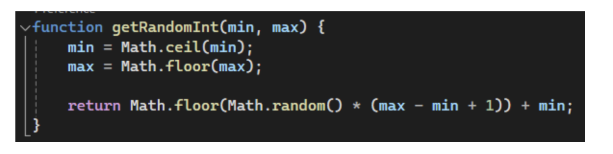

### 2. `generateSequence()`:
* This is just their take on the `random()` for the Tetris pieces.
* This method creates a sequence of letters. Does a while loop where `getRandomInt()` takes in the min value 0 and max of `seq.len -1`. It then chooses a random letter from sequence and removes it and adds it to another array [0]

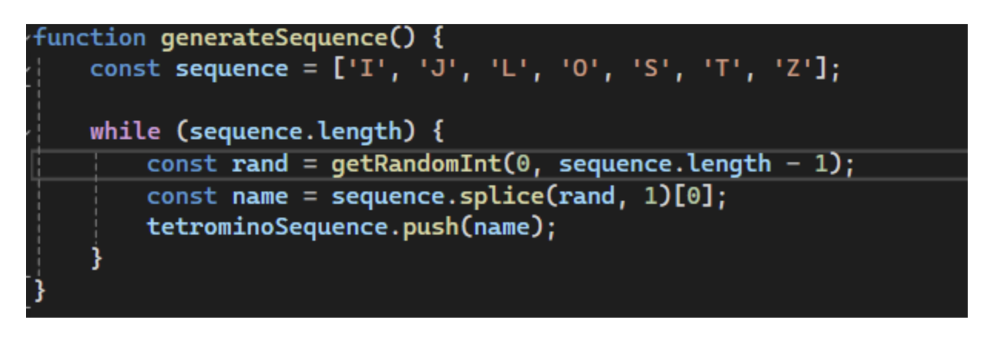

### 3. `getNextTetromino()`:

* This method start by checking if `terominoSequence` is empty. If it is, call the last method `generateSequence` for values.
* Else, it will pop the last item in the array `terominoSequence` and return the value that will be used in teromino to determine the sequence. Basically, it returns one of the letters e.g. "L" that is associated with its matrix pattern.
* The rest is already commented.

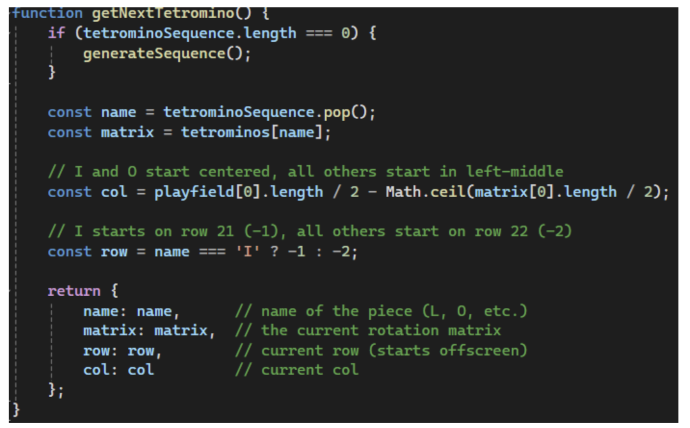

### 4. `rotate()`:
* It's in the Name

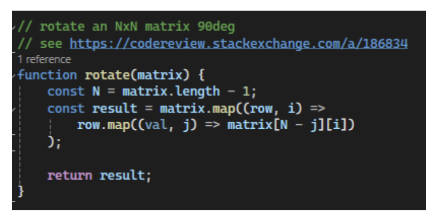

### 5. `isValidMove()`:

* This is game logic. The function determines if a tetromino can be placed at a given position without going out of bounds or colliding with another piece.

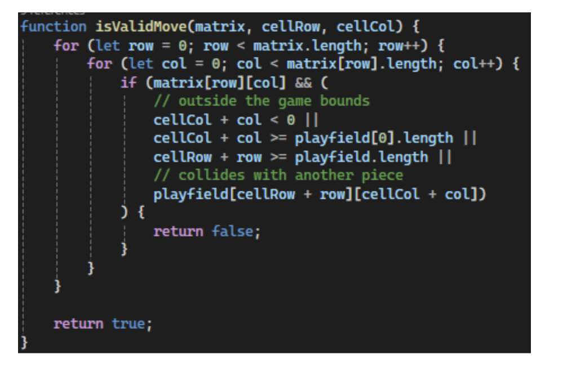

### 6. `placeTetromino()`
* Places the tetromino onto the playfield. If any part of the piece is above the screen when placed, the game ends. Updates the playfield array to reflect the tetromino's position.

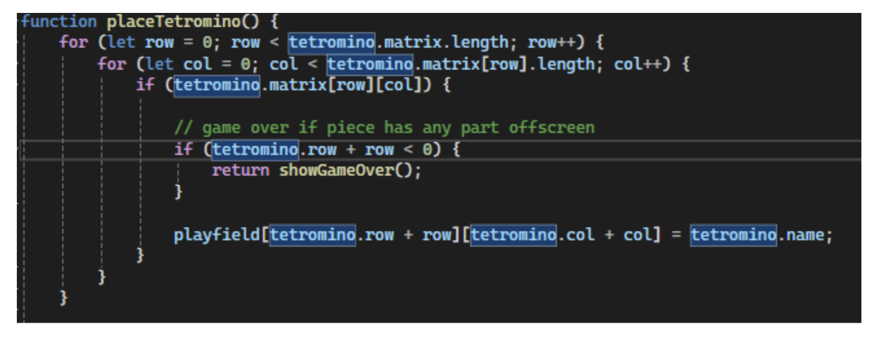

### 7. Check if row is full
* Starts from bottom and goes up checking if the row is full across. If it is, remove the row and drop the row above by one. Else, move to next row.

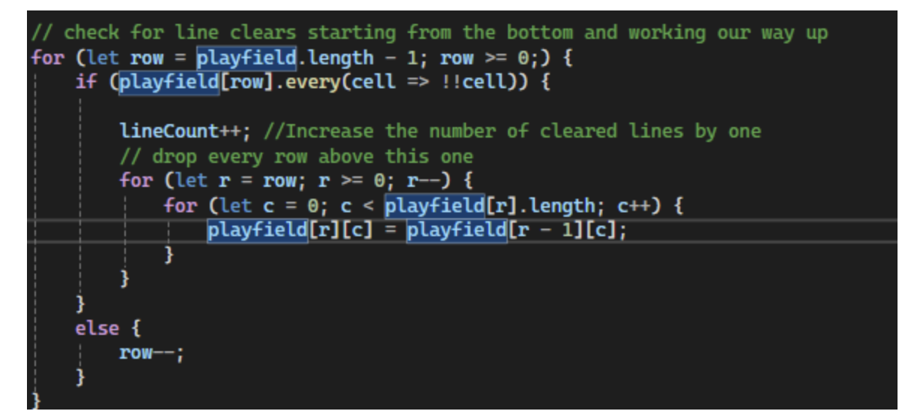

### 8. Get new piece and update score
* I mean, come on. You understand.

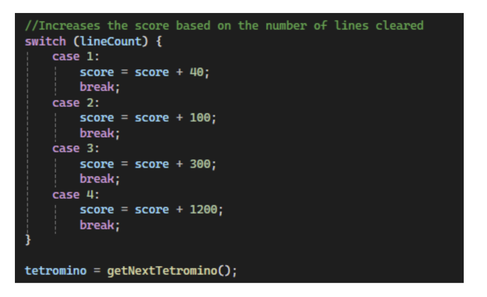

### 9. Making the Tetris board
* Read the green comments. They got it.

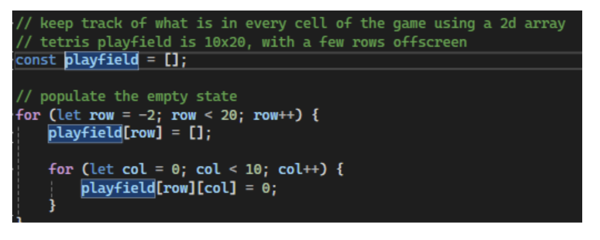

### 10. Tetrominos
* They made the shapes of all the Tetris pieces using matrices. This is one of them. You can look at the rest. I will put colors of them with this as well.

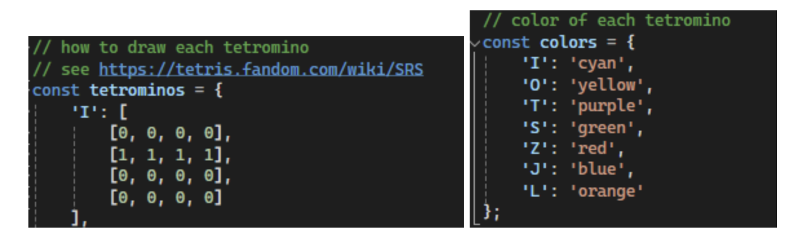

### 11. Setting initial values
* Prior to starting the initial values are set

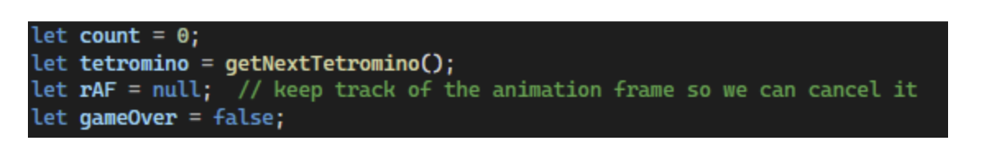

### 12. Remaining
* There are 2 methods left Loop and add even Listener.
  * **Loop()**
    * This is the main game logic. They did a good job at commenting on this part so read the comments. You'll be fine.
  * **AddEventListener()**
    * This portion is how the keyboard strokes accomplish the movements for the game. They also did comment this well, so give it a read.

## 2. Tetris Controller Class

* This Game Info came up on the swagger website when I ran it, but not the actual game. I commented the code with the information.

## 3. Game Info Class

* Holds game metadata such as title, description, and instructions for playing. This class is used to provide a quick overview of the game. This is not used in the JavaScript only in the controller

## 4. Tetris Docker File

* I went ahead and just commented on all the for this section as I thought it would be easier this way.

---

## Required Images:
* `images/TetrisDocumentation/image_1.png`
* `images/TetrisDocumentation/image_2.png`
* `images/TetrisDocumentation/image_3.png`
* `images/TetrisDocumentation/image_4.png`
* `images/TetrisDocumentation/image_5.png`
* `images/TetrisDocumentation/image_6.png`
* `images/TetrisDocumentation/image_7.png`
* `images/TetrisDocumentation/image_8.png`
* `images/TetrisDocumentation/image_9.png`
* `images/TetrisDocumentation/image_10.png`
* `images/TetrisDocumentation/image_11.png`
* `images/TetrisDocumentation/image_12.png`
* `images/TetrisDocumentation/image_13.png`
* `images/TetrisDocumentation/image_14.png`